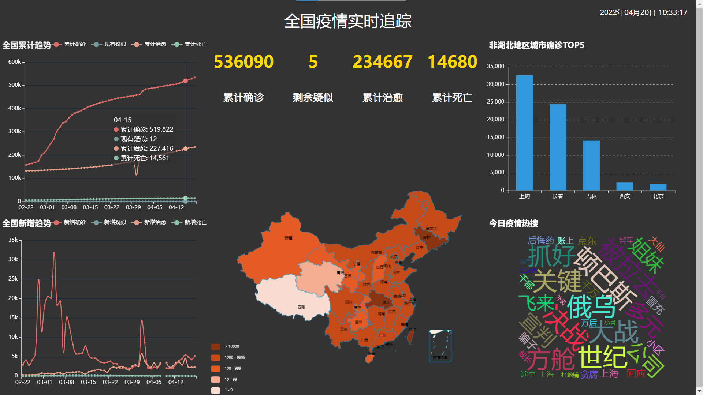

# flask-cov
基于[ Flask ](https://github.com/pallets/flask)框架以及[ echarts ](https://github.com/apache/echarts/)开发的疫情可视化网页

## 项目介绍
本项目基于[ Python爬取疫情实战 ](https://www.bilibili.com/video/BV177411j7qJ)开发。可点击 [此处](http://yorushika.xyz:8888/) 预览成功部署后的页面。本项目使用Flask作为web服务框架，提供后台数据接口，利用python实现公开数据的抓取并插入数据库，前端基于jquery使用ajax异步加载数据，echarts根据填充的数据进行可视化。

## 效果图

### 安装使用

- 安装python3.6以上版本和mysql数据库(推荐5.7版本)
- 按照 `database.txt` 中的内容配置好mysql数据库
- 安装 Google Chrome 和 chromedriver
- 克隆项目到本地 `git clone 地址`
- 切换到项目所在目录 `cd YQ/`
- 安装依赖的包 `pip install -r requirements.txt`
- 打开config.py文件配置数据库相关信息
- 手动更新数据 `python spider.py`
- 开启服务 `python app.py`

### 注意事项

- 若网页打开数据显示不全，请按 ctrl + F5 进行刷新，如果不行，请多刷新几次
- 项目中chromedriver适用于Google Chrome98版本，其他版本请前往 [此处](https://chromedriver.storage.googleapis.com/index.html) 下载并复制到项目所在目录。
- 仅需本地部署服务时，在`app.py`最后选择本地部署，注释掉倒数第三行
- 项目启动前需手动更新一次数据（运行spider.py），之后程序会每隔6小时自动更新数据，可在`config.py`中修改

